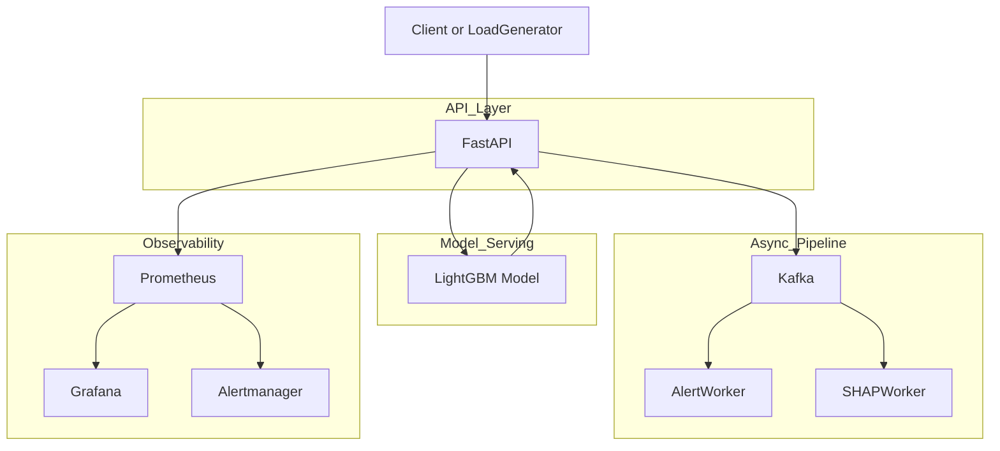
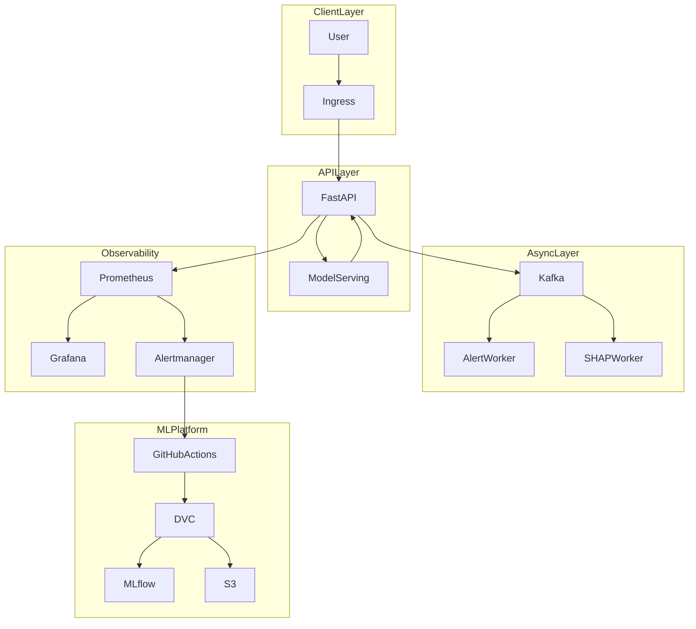
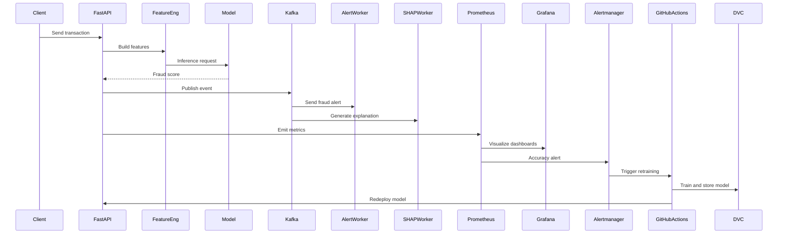
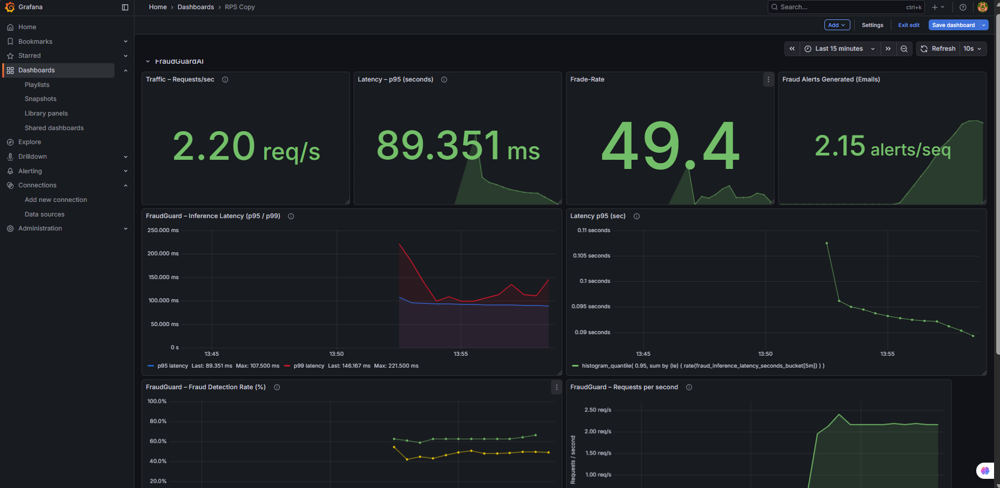
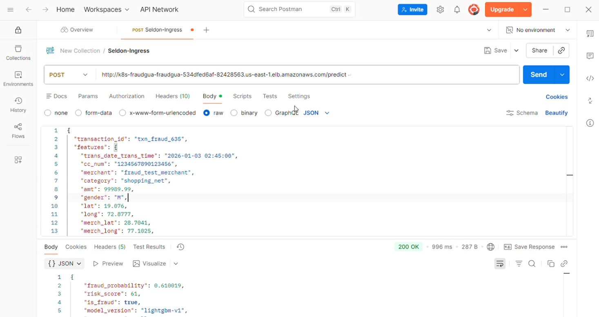
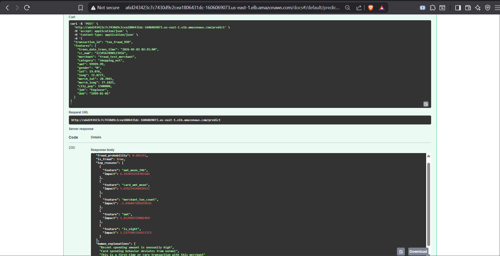
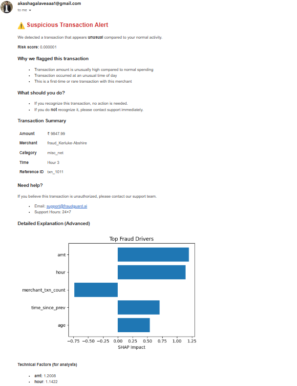
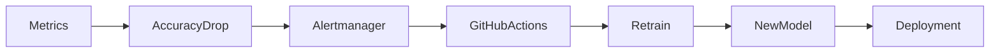

# 🛡️ FraudGuard AI
### End-to-End Real-Time Fraud Detection & Automated MLOps Platform


## 📖 Introduction
**FraudGuard AI** is not just a model; it is a complete **MLOps ecosystem** designed to solve the "stale model" problem in financial systems. 

It combines **real-time inference** with an **event-driven architecture** to handle high-throughput transactions while ensuring the model remains accurate through **automated drift detection and retraining**.

### 🚀 Key Capabilities
*   ⚡ **Low Latency:** ~25 ms P95 and ~31 ms P99 application latency measured under ~1.2K RPS using FastAPI & LightGBM.
*   📨 **Async Processing:** Kafka decouples critical inference from heavy tasks (Alerts, SHAP).
*   👁️ **Full Observability:** Prometheus & Grafana track system health & model drift.
*   🔄 **Self-Healing:** If accuracy drops below 85%, the system **automatically** triggers a GitHub Action to retrain and redeploy the model without human intervention.

---

## 🔍 Problem Statement

Modern digital payment systems face:

* Millions of transactions per day
* Rapidly evolving fraud patterns
* Strict latency SLAs (** sub-50 ms application latency for real-time inference**)
* Continuous model degradation in production

### Why traditional ML systems fail

* Static models
* No production monitoring
* Manual retraining and deployment
* No rollback, canary, or safety mechanisms

---

## 🎯 Solution Overview

FraudGuard solves this by combining:

* **Real-time inference**
* **Asynchronous fraud alerting**
* **Production monitoring**
* **Accuracy-based automated retraining**
* **Kubernetes-native deployment**

**Result:**
➡️ A **self-healing ML system** with minimal manual intervention.

---

## 🧱 High-Level Architecture (Production View)



**Key idea:**

* Latency-critical path stays **synchronous**
* Alerts, explanations, and monitoring are **fully asynchronous**

---

## 🏗️ Technical Architecture (Layered Design)



---

## 🔁 End-to-End Production Flow (13-Step Lifecycle)



---

## 📊 Data Engineering & Training

* **DVC** for data and pipeline versioning
* **Amazon S3** for scalable artifact storage
* **MLflow (DAGsHub)** for experiment tracking
* Fully reproducible pipelines via `dvc.yaml`

```text
raw -> processed -> features -> model
```

---

## 🤖 Model Serving Strategy (Production Decision)

* **Model**: LightGBM
* **Initial Serving**: Seldon Core
* **Production Canary and A/B**: FastAPI with NGINX Ingress on EKS

### Why this evolution?

* Seldon was explored for ML-native serving patterns
* Canary and A/B testing were **successfully implemented using NGINX Ingress**, which provided:

  * Fine-grained traffic control
  * Easier debugging
  * Faster rollback

> This reflects a real-world engineering trade-off, where operational reliability,
observability, and rollback safety were prioritized over higher-level abstractions.


---

## ⚡ Asynchronous Processing

* **Kafka** decouples inference from alerting
* Prevents API blocking
* Enables independent scaling

Consumers:

* Alert Worker (Email notifications)
* SHAP Worker (Explainability)

---

## 📈 Monitoring & Observability

### Metrics tracked

* Request throughput
* P95 and P99 application and model inference latency
* Fraud detection rate
* Alert generation rate
* **Production model accuracy**

Model accuracy is the **primary retraining trigger**.

---

## 📊 Production Results



**Observed performance**

* Sustained **~1.1–1.2K RPS** through AWS ALB using Locust
* Application **P95 latency < 25 ms**
* Application **P99 latency < 31 ms**
* Model inference P95 latency ~24 ms
* Stable throughput with no alert pipeline failures

---

## 🔌 API Validation

### Postman Prediction



### AWS Load Balancer Access



---

## 🚨 Real-Time Fraud Alert Proof



Validated pipeline:

**FastAPI -> Kafka -> AlertWorker -> Email**

---

## 🔄 Automated Retraining (Accuracy-Based)



**Trigger condition**

```text
model_accuracy < 85 percent for 10 minutes
```

---

## 🛠️ Tech Stack

* **Backend**: FastAPI, Python
* **ML**: LightGBM, SHAP
* **MLOps**: DVC, MLflow, GitHub Actions
* **Infrastructure**: AWS EKS, S3, ALB, NGINX Ingress
* **Streaming**: Kafka
* **Monitoring**: Prometheus, Grafana, Alertmanager
* **Serving**: FastAPI (Primary), Seldon Core (Explored)

---

## 🏁 Final Takeaway

> FraudGuard is a **production-grade, self-healing fraud detection platform** that continuously monitors model accuracy and automatically retrains and redeploys models, ensuring **low latency**, **high accuracy**, and **operational reliability**.

---


