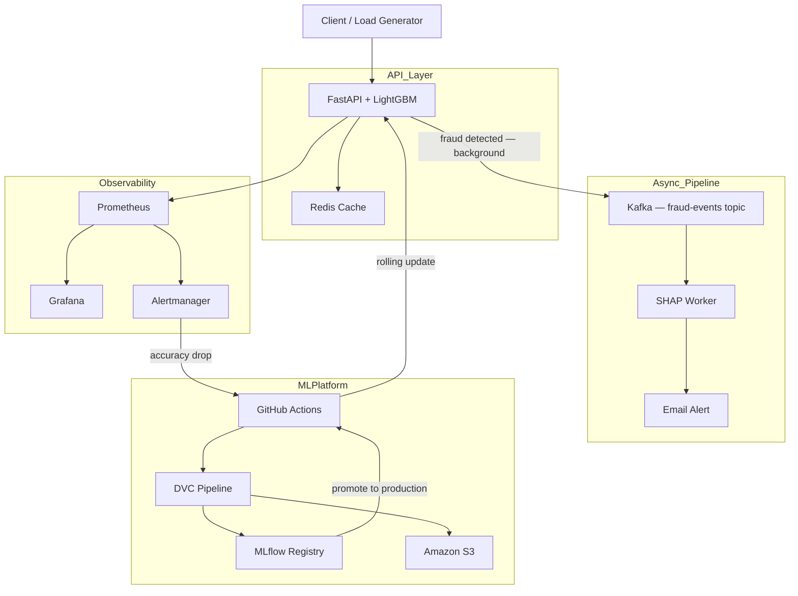
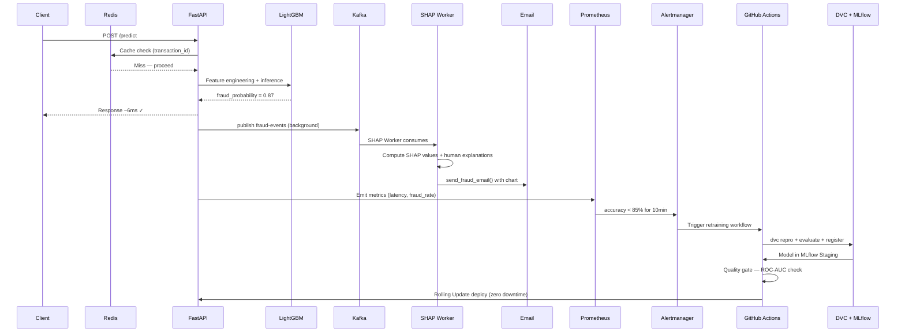
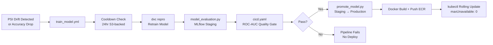
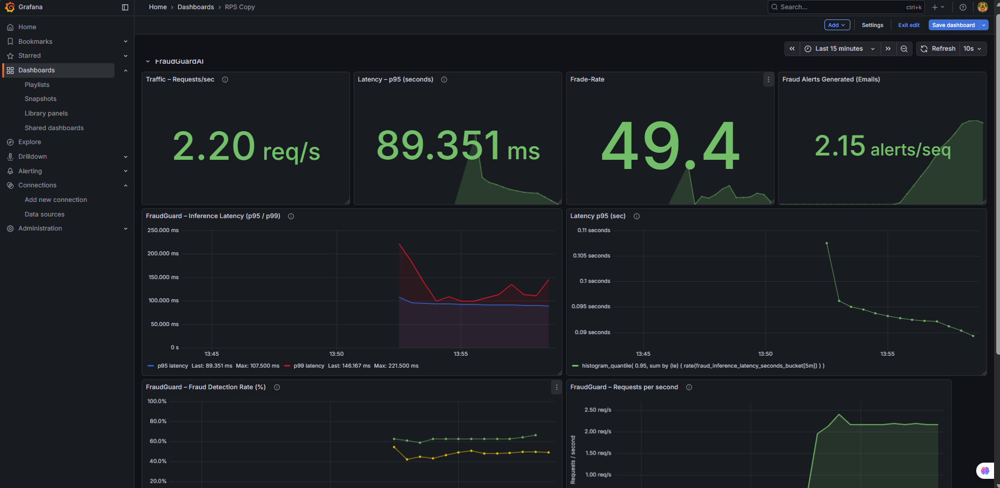
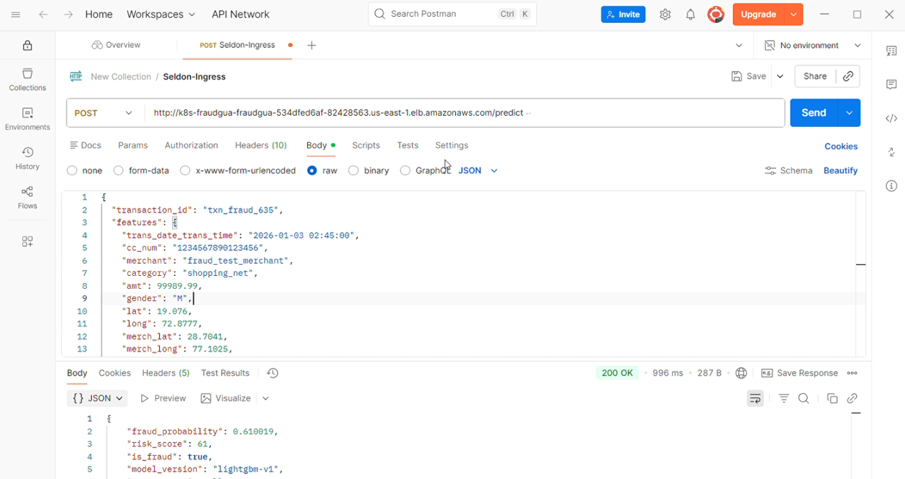
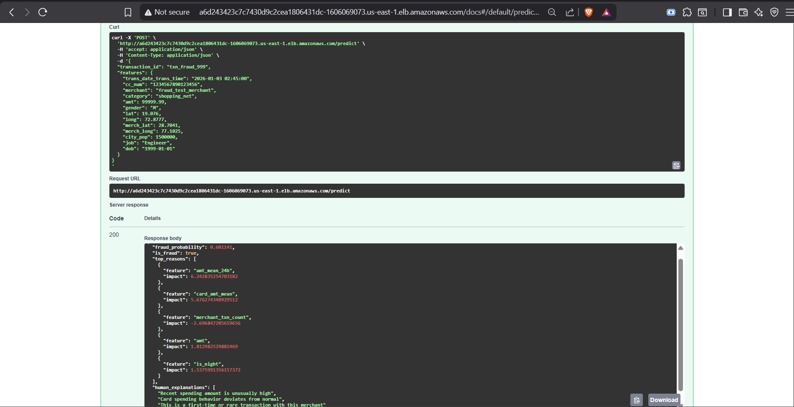
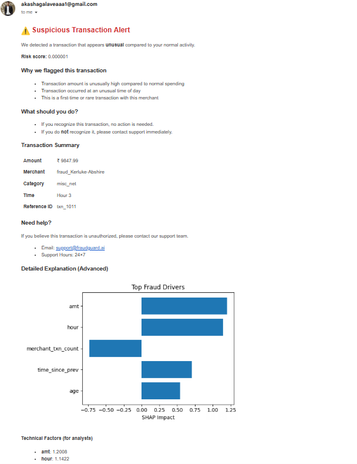

# 🛡️ FraudGuard AI
### End-to-End Real-Time Fraud Detection & Automated MLOps Platform


---

## 📖 Introduction

**FraudGuard AI** is a production-grade, self-healing fraud detection platform — not just a model.

It solves the **"stale model" problem** in financial systems by combining real-time inference with an event-driven architecture, automated drift detection, and a fully automated retraining pipeline — all running on Kubernetes with zero manual intervention.

### 🚀 Key Capabilities

- ⚡ **Low Latency** — P95 ~24ms and P99 ~31ms model inference at 1.2K RPS on AWS EKS
- 📨 **Async Event Pipeline** — Kafka decouples inference from SHAP explanations and email alerts
- 👁️ **Full Observability** — Prometheus + Grafana track throughput, latency, fraud rate, and model accuracy in real time
- 🔄 **Self-Healing** — Accuracy drop below 85% triggers automated GitHub Actions retraining and zero-downtime Rolling Update deployment
- 🧠 **Explainability** — SHAP-based fraud explanations with human-readable reasons delivered via email alert

---

## 🔍 Problem Statement

Modern digital payment systems face:

- Millions of transactions per day with strict sub-50ms latency SLAs
- Rapidly evolving fraud patterns that degrade static models over time
- No visibility into when or why model performance drops
- Manual retraining and deployment cycles that are too slow

### Why traditional ML systems fail

| Problem | Traditional Approach | FraudGuard Approach |
|---------|---------------------|---------------------|
| Model degradation | Noticed weeks later | PSI drift detection + accuracy alerts |
| Retraining | Manual, ad-hoc | Automated GitHub Actions pipeline |
| Deployment | Downtime required | Rolling Update, maxUnavailable: 0 |
| Alerting | Synchronous, blocks API | Async Kafka pipeline |
| Explainability | Black box | SHAP with human-readable email |

---

## 🎯 Solution Overview

FraudGuard solves this by combining:

- **Real-time inference** via FastAPI + LightGBM
- **Asynchronous fraud alerting** via Kafka + SHAP Worker
- **Production monitoring** via Prometheus + Grafana + Alertmanager
- **Automated drift detection** via PSI-based drift detector
- **Automated retraining** via GitHub Actions + DVC + MLflow
- **Zero-downtime deployment** via Kubernetes Rolling Update

**Result:** A self-healing ML system that monitors itself, retrains itself, and deploys itself.

---

## 🧱 High-Level Architecture


```mermaid
flowchart TD
    Client[Client / Load Generator]

    subgraph API_Layer
        API[FastAPI + LightGBM]
        Redis[Redis Cache]
    end

    subgraph Async_Pipeline
        Kafka[Kafka — fraud-events topic]
        SHAP[SHAP Worker]
        Email[Email Alert]
    end

    subgraph Observability
        Prom[Prometheus]
        Grafana[Grafana]
        Alertmanager[Alertmanager]
    end

    subgraph MLPlatform
        GH[GitHub Actions]
        DVC[DVC Pipeline]
        MLflow[MLflow Registry]
        S3[Amazon S3]
    end

    Client --> API
    API --> Redis
    API -->|fraud detected — background| Kafka
    Kafka --> SHAP
    SHAP --> Email
    API --> Prom
    Prom --> Grafana
    Prom --> Alertmanager
    Alertmanager -->|accuracy drop| GH
    GH --> DVC --> S3
    DVC --> MLflow
    MLflow -->|promote to production| GH
    GH -->|rolling update| API
```

**Key design principle:**
- Latency-critical path stays **synchronous** — predict and return
- SHAP, email, metrics — fully **asynchronous** via Kafka

---

## 🔁 End-to-End Production Flow


```mermaid
sequenceDiagram
    participant C as Client
    participant R as Redis
    participant API as FastAPI
    participant M as LightGBM
    participant K as Kafka
    participant S as SHAP Worker
    participant E as Email
    participant P as Prometheus
    participant AM as Alertmanager
    participant GH as GitHub Actions
    participant DVC as DVC + MLflow

    C->>API: POST /predict
    API->>R: Cache check (transaction_id)
    R-->>API: Miss — proceed
    API->>M: Feature engineering + inference
    M-->>API: fraud_probability = 0.87
    API-->>C: Response ~6ms ✓

    API->>K: publish fraud-events (background)
    K->>S: SHAP Worker consumes
    S->>S: Compute SHAP values + human explanations
    S->>E: send_fraud_email() with chart

    API->>P: Emit metrics (latency, fraud_rate)
    P->>AM: accuracy < 85% for 10min
    AM->>GH: Trigger retraining workflow
    GH->>DVC: dvc repro + evaluate + register
    DVC->>GH: Model in MLflow Staging
    GH->>GH: Quality gate — ROC-AUC check
    GH->>API: Rolling Update deploy (zero downtime)
```

---

## 📊 Data Engineering & Feature Pipeline

- **DVC** for data and pipeline versioning — fully reproducible via `dvc repro`
- **Amazon S3** for raw data and artifact storage
- **MLflow on DagsHub** for experiment tracking and model registry

```
data/external/  →  data/raw/  →  data/interim/  →  data/processed/  →  model
     ↑                ↑               ↑                   ↑
  DVC tracked      ingestion      preprocessing      feature_engineering
```

### Feature Engineering

| Feature Group | Features | Training + Serving |
|--------------|----------|-------------------|
| Transaction | amt_log, amt_zscore, amt_bucket | ✅ Both |
| Geographic | distance_km (Haversine), distance_anomaly | ✅ Both |
| Temporal | hour, day_of_week, is_night, is_weekend | ✅ Both |
| Merchant | merchant_txn_count, city_pop_bucket | ✅ Both |
| Card behavior | card_amt_zscore, card_dist_mean, card_amt_std | ✅ Both |

> **Note:** Velocity features (txn_1h, txn_24h) were intentionally excluded.
> At serving time, single-row inference cannot compute rolling windows correctly —
> this would introduce training-serving skew. Proper implementation requires
> per-card transaction history in Redis, which is a planned future enhancement.

---

## 🤖 Model

| Property | Value |
|----------|-------|
| Algorithm | LightGBM (LGBM Classifier) |
| Class imbalance | cost-sensitive learning (`class_weight="balanced"`) |
| Threshold | F1-optimized via precision-recall curve |
| PR-AUC | 0.945 |
| ROC-AUC | tracked in MLflow |
| Explainability | SHAP TreeExplainer |

---

## ⚡ Serving Architecture

```
POST /predict
    │
    ├── Redis cache check (TTL: 1hr)
    │       hit → return cached result instantly
    │
    ├── Feature engineering (_build_feature_df)
    │
    ├── LightGBM inference → fraud_probability
    │
    ├── Prometheus metrics update
    │
    ├── Redis cache write
    │
    ├── return PredictionResponse  ← user gets this (~6ms)
    │
    └── [BackgroundTask — non-blocking]
            └── Kafka publish → fraud-events topic
```

### Why Redis cache?

Same `transaction_id` sent twice (network retry, duplicate request) — cache hit returns instantly without re-running inference. Prevents duplicate Kafka events for same transaction.

---

## 📨 Async Kafka Pipeline

```
fraud-events topic
        ↓
SHAP Worker (services/shap-worker/)
    ├── build_feature_df()
    ├── shap.TreeExplainer → top 5 features
    ├── generate_shap_bar_chart() → base64 PNG
    ├── generate_human_explanations() → plain English
    └── send_fraud_email() → customer alert with chart
```

**Why Kafka and not direct background task?**

| | FastAPI BackgroundTask | Kafka |
|--|----------------------|-------|
| Pod crash | Message lost | Retained for 7 days |
| Worker slow | Blocks thread pool | Independent scaling |
| Add new consumer | Change FastAPI code | Just subscribe to topic |
| Audit / replay | Not possible | Replay from any offset |

---

## 📈 Monitoring & Observability

### Prometheus Metrics

| Metric | Type | Description |
|--------|------|-------------|
| `http_requests_total` | Counter | Total requests by method/path/status |
| `http_request_latency_seconds` | Histogram | End-to-end latency |
| `fraud_model_inference_latency_seconds` | Histogram | Pure model inference time |
| `fraud_predictions_total` | Counter | Total predictions by version/is_fraud |
| `fraud_positive_predictions_total` | Counter | Fraud positives per version |
| `fraud_probability_distribution` | Histogram | Raw score distribution |

### Alerting Rules

- `FraudGuardModelAccuracyDrop` — accuracy < 85% for 10 minutes → triggers retraining
- Custom HPA metric `fraud_latency_p95` — scales pods on latency, not just CPU

---

## 🔄 Automated Retraining Pipeline


```mermaid
flowchart LR
    A[PSI Drift Detected\nor Accuracy Drop] --> B[train_model.yml]
    B --> C[Cooldown Check\n24hr S3-backed]
    C --> D[dvc repro\nRetrain Model]
    D --> E[model_evaluation.py\nMLflow Staging]
    E --> F[cicd.yaml\nROC-AUC Quality Gate]
    F --> G{Pass?}
    G -->|Yes| H[promote_model.py\nStaging → Production]
    G -->|No| I[Pipeline Fails\nNo Deploy]
    H --> J[Docker Build + Push ECR]
    J --> K[kubectl Rolling Update\nmaxUnavailable: 0]
```

### Two retraining triggers

1. **Drift-based** — `scripts/drift_detector.py` computes PSI between training and live data. PSI > 0.2 writes `retrain.flag` → `train_model.yml` picks it up
2. **Accuracy-based** — Prometheus alert fires when `model_accuracy < 0.85` for 10 minutes → Alertmanager calls GitHub Actions webhook

### Cooldown mechanism

Last retrain timestamp stored in S3 (`s3://fraudguard-raw-data/meta/last_retrain.txt`). If < 24 hours since last retrain — pipeline exits early. Prevents retraining storms.

---

## 🚀 Deployment

### Zero-Downtime Rolling Update

```yaml
strategy:
  type: RollingUpdate
  rollingUpdate:
    maxUnavailable: 0   # no pod goes down until new one is ready
    maxSurge: 1         # one extra pod spins up during update
```

New pod must pass `/health` readiness probe before old pod is terminated. Users experience zero downtime.

### Rollback

```bash
kubectl rollout undo deployment/fraudguard-fastapi -n fraudguard
```

Kubernetes maintains deployment history — one command to revert.

### Auto-scaling

```yaml
# HPA scales on custom Prometheus metric — latency, not just CPU
metric: fraud_latency_p95
target: 200ms
minReplicas: 2
maxReplicas: 10
```

---

## 📊 Production Results



| Metric | Value |
|--------|-------|
| Sustained RPS | ~1.1–1.2K |
| Application P95 latency | < 25ms |
| Application P99 latency | < 31ms |
| Model inference P95 | ~24ms |
| PR-AUC | 0.945 |

---

## 🔌 API

### Prediction

```bash
POST /predict
{
  "transaction_id": "txn_abc123",
  "features": {
    "amt": 5000.0,
    "trans_date_trans_time": "2024-01-15 02:30:00",
    "lat": 28.6, "long": 77.2,
    "merch_lat": 19.0, "merch_long": 72.8,
    "merchant": "fraud_store_xyz",
    "category": "misc_net",
    "city_pop": 12000000,
    "gender": "M", "job": "Engineer", "age": 32
  }
}
```

```json
{
  "fraud_probability": 0.87,
  "risk_score": 87,
  "is_fraud": true,
  "model_version": "stable"
}
```

### SHAP Explanation

```bash
POST /predict/explain
```

Returns same response + `top_reasons` with SHAP feature impacts for audit/investigation.

### Health + Metrics

```bash
GET /health    → model version, threshold, load status
GET /metrics   → Prometheus scrape endpoint
```




---

## 🚨 Fraud Alert Email

SHAP Worker computes explanation and sends email with:
- Risk score and fraud probability
- Human-readable reasons ("Transaction at unusual hour", "Amount unusually high")
- SHAP bar chart (base64 PNG embedded)
- Transaction summary



---

## 🛠️ Tech Stack

| Layer | Technology |
|-------|-----------|
| API | FastAPI, Python 3.11 |
| Model | LightGBM, SHAP |
| Cache | Redis |
| Streaming | Apache Kafka (Strimzi on K8s) |
| MLOps | DVC, MLflow, DagsHub, GitHub Actions |
| Infrastructure | AWS EKS, ECR, S3, ALB |
| Monitoring | Prometheus, Grafana, Alertmanager |
| Container | Docker, Kubernetes |

---

## 📁 Project Structure

```
fraudguard-ai/
├── serving/                    # FastAPI app, model loader, Kafka producer
│   ├── app.py                  # main endpoints + Prometheus metrics
│   ├── kafka_producer.py       # fraud event publisher
│   ├── redis_client.py         # async cache
│   ├── email_service.py        # SMTP alert sender
│   └── model_loader.py         # MLflow model loading
├── services/
│   └── shap-worker/            # Kafka consumer → SHAP → email
├── src/
│   ├── data/                   # ingestion + preprocessing
│   ├── features/               # feature engineering pipeline
│   └── model/                  # training, evaluation, registry
├── scripts/
│   ├── drift_detector.py       # PSI-based drift detection
│   ├── model_quality_check.py  # ROC-AUC gate
│   └── promote_model.py        # MLflow staging → production
├── infrastructure/kubernetes/  # all K8s manifests
│   ├── fastapi/                # deployment, service
│   ├── kafka/                  # cluster, topics
│   ├── monitoring/             # ServiceMonitor, alerts
│   ├── hpa/                    # custom metric autoscaler
│   ├── ingress/                # AWS ALB ingress
│   ├── redis/                  # Redis deployment
│   └── shap-worker/            # SHAP worker deployment
├── monitoring/                 # Prometheus rules + Alertmanager config
├── .github/workflows/
│   ├── train_model.yml         # drift/schedule triggered retraining
│   ├── cicd.yaml               # quality gate + promote + deploy
│   └── deploy_workers.yml      # SHAP worker deploy on code change
└── notebooks/EDA.ipynb         # exploratory data analysis
```

---

## 🏁 Final Takeaway

> FraudGuard is a **production-grade, self-healing fraud detection platform** that monitors its own accuracy, detects data drift, automatically retrains with a quality gate, and deploys with zero downtime — all without human intervention.